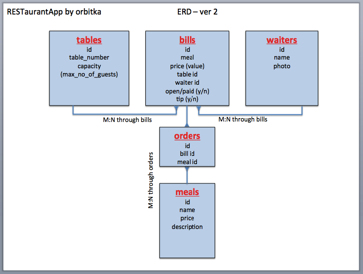
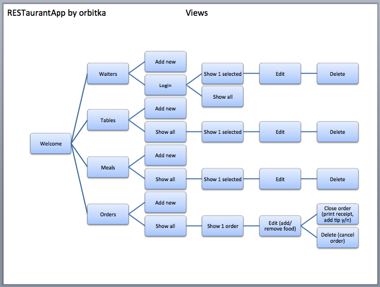

RESTaurant App

The application is designed as a daily operation tool for waiters in a small restaurant.

**Basic features**

- We cover interactions between 4 basic models:
  - waiters,
  - tables,
  - meals,
  - orders.

**Initial ERD (Entity Relationship Diagram):**
  

  **Views:**
  

**USER STORIES:**
- As a waiter I want to be able to add/remove/modify tables so they reflect the current layout.
- As a waiter I want to have login access so my data is confidential and protected.
- As a waiter I want to see all my orders so I can see my daily sales.
- As a restaurant manager I want to be able to add/modify/remove meals to the menu so we can sell them.
- As a waiter I want to be able to close the bill and print the receipt (image).
- As a waiter I want to add info about customer satisfaction (tip y/n) so my profile can show my performance (percentage of happy customers).
