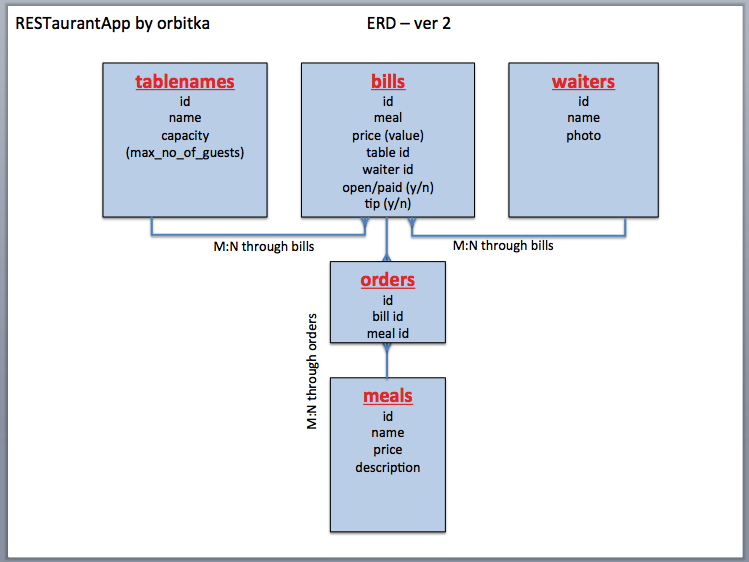
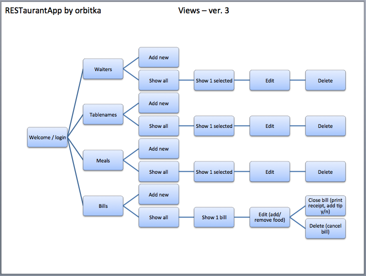
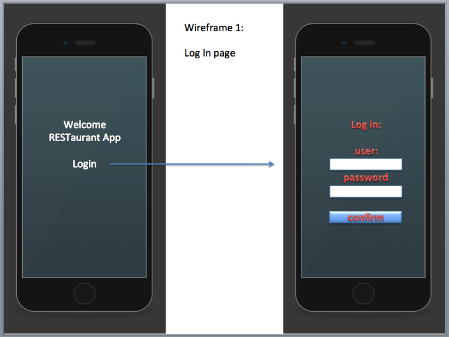
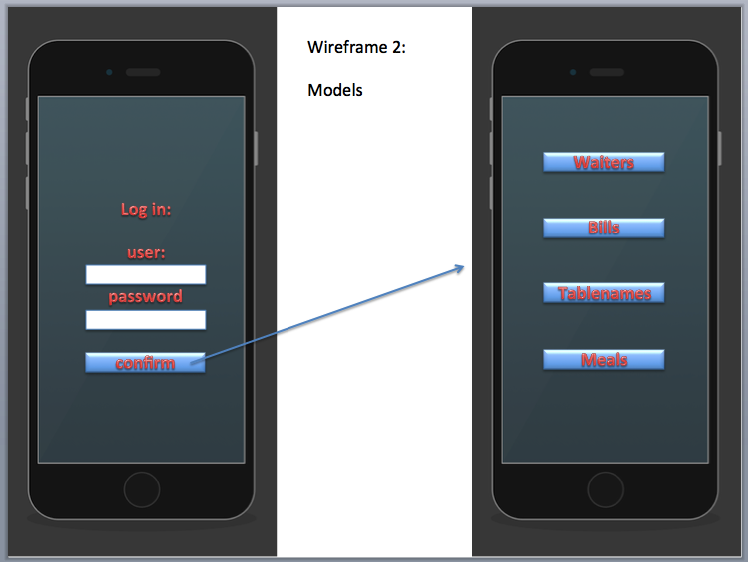
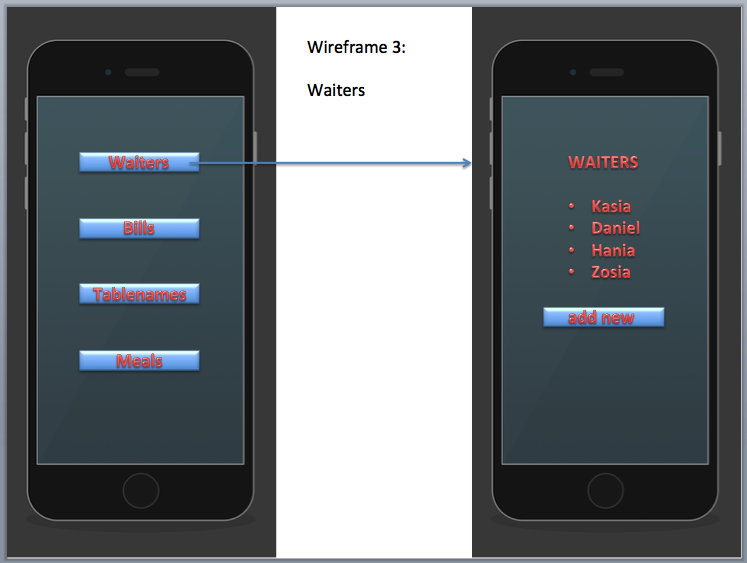
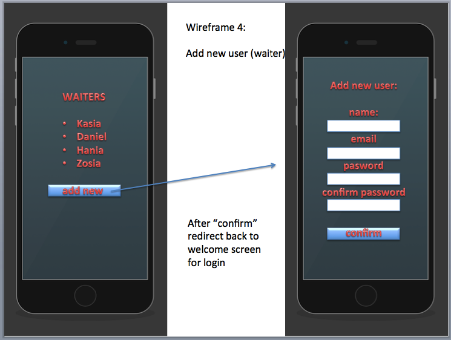
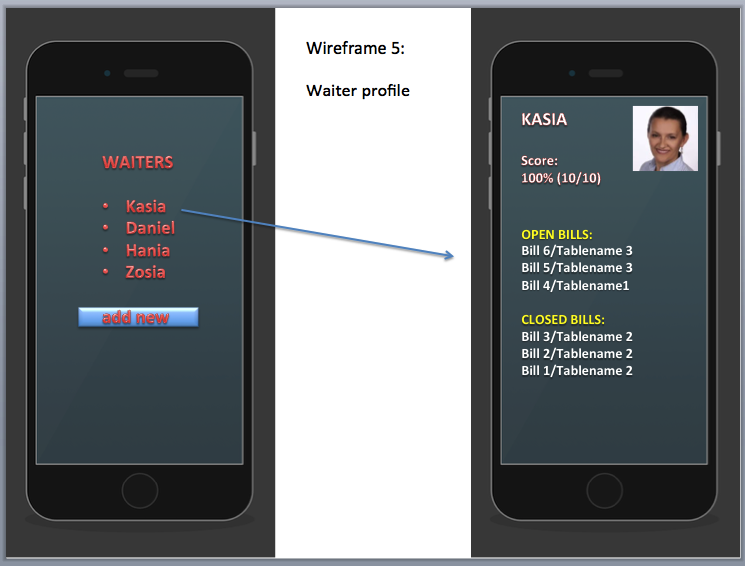
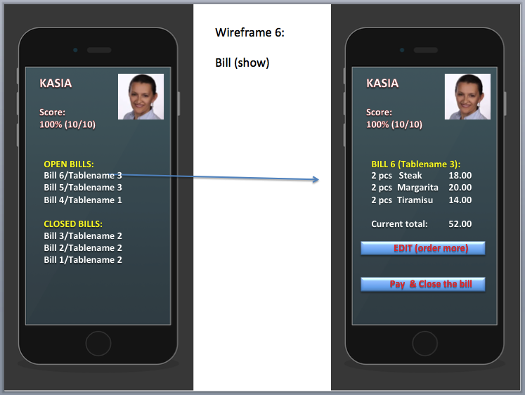
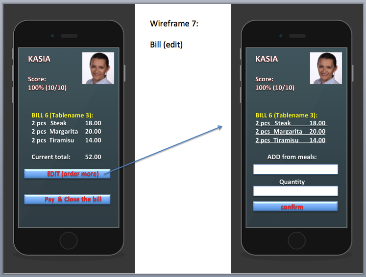

RESTaurant App

The application is designed as a daily operation tool for waiters in a small restaurant.

App on heroku: https://restaurant-orbitka.herokuapp.com/  ( it does not work anymore --> heroku discontinued free plans)

**Basic features**

- We cover interactions between 4 basic models:
  - waiters,
  - tables,
  - meals,
  - bills.

**Initial ERD (Entity Relationship Diagram):**

  

  **Views:**

  

**USER STORIES:**
- As a waiter I want to be able to see table names so I know where to deliver food and which bill belongs to which guest without memorizing bill numbers.
- As a waiter I want to have login access so my data is confidential and protected.
- As a waiter I want to see all my bills so I can see my daily sales.
- As a restaurant manager I want to be able to add/modify/remove meals to the menu so we can sell them.
- As a waiter I want to be able to close the bill and print the receipt (image).
- As a waiter I want to add info about customer satisfaction (tip y/n) so my profile can show my performance (percentage of happy customers).

**Examples of wireframes:**

- Login page:

- Main models:

- Index page in the module: Waiters

- Add new waiter
  - (in this version we have only one type of users)

- Waiter profile

- Preview of 1 selected bill (with details)

- Edit page for the bill

tbc
